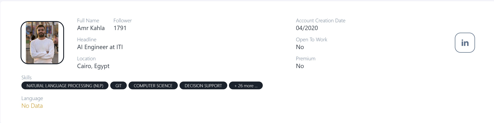

# 🤖 Agentic Ice Breaker Project

A LangChain-powered AI assistant that generates personalized conversation starters ("ice breakers") based on a LinkedIn profile. It uses agentic reasoning and web search tools to fetch relevant data and generate insights for outreach, especially in professional or recruitment contexts.

---

## 🚀 Features

- 🔍 **LinkedIn Profile Lookup**: Uses Tavily search to locate public LinkedIn profiles from a person's name.
- 🧠 **LangChain Agent**: Employs a ReAct-style agent to decide how to retrieve and analyze information.
- 💬 **Ice Breaker Generation**: Creates context-aware conversation starters that feel human and relevant.
- 🛠️ **Modular Tooling**: Tools like web search and profile lookup are registered for use within the agent.
- 📂 Organized Structure: Clear separation between tools, agents, and main entrypoints.

---

## 📁 Project Structure

```
agentic-ice-breaker-project/
├── agents/
│   └── linkedin_lookup.py        # Agent logic for fetching profile and generating output
├── tools/
│   └── tools.py                  # Tavily search tool for LinkedIn profile lookup
├── ice_breaker.py               # Main entry point to run the full pipeline
├── .env                         # Environment variables (e.g., API keys)
├── requirements.txt             # Project dependencies
└── README.md                    # Project documentation
```

---

## 🧪 Setup & Usage

### 1. Clone the Repo

```bash
git clone https://github.com/Amrokahla/agentic-ice-breaker-project-
cd agentic-ice-breaker-project-
```

### 2. Install Dependencies with Pipenv

```bash
pip install pipenv
pipenv shell
pipenv install
```

### 3. Set Up Environment Variables

Create a `.env` file with the following:

```env
TAVILY_API_KEY= your_tavily_key_here
SCRAPINIO__API_KEY= your_scrapino_api_key
GOOGLE_API_KEY= your_google_key_here     # or any model you want to use
```

### 4. Run the Ice Breaker Generator

```bash
python ice_breaker.py
```

When prompted, enter a name (e.g., `Amro Kahla`) and get personalized conversation starters.

---

## 🧠 How It Works

1. **Profile Search**: The agent first uses Tavily to find a LinkedIn profile URL.
2. **Data Analysis**: It then crafts prompts using the profile data (if available).
3. **Conversation Generation**: Finally, GPT generates relevant and friendly ice breakers.

---

## 📄 License

Apache License

---

## 🙋‍♂️ Author

**Amro Kahla**\
[GitHub](https://github.com/Amrokahla) | [LinkedIn](https://www.linkedin.com/in/amr-kahla-9447841a7/)

---

> "Make your first impression count with smart, AI-powered ice breakers."

